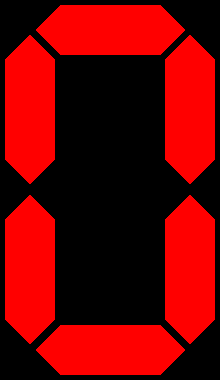

class representing a seven segment display

this class generates a pillow image emulating a seven segment display
there is an example in example.py for how you can create multiple
images for different digits and colors, and even merge them into a gif

